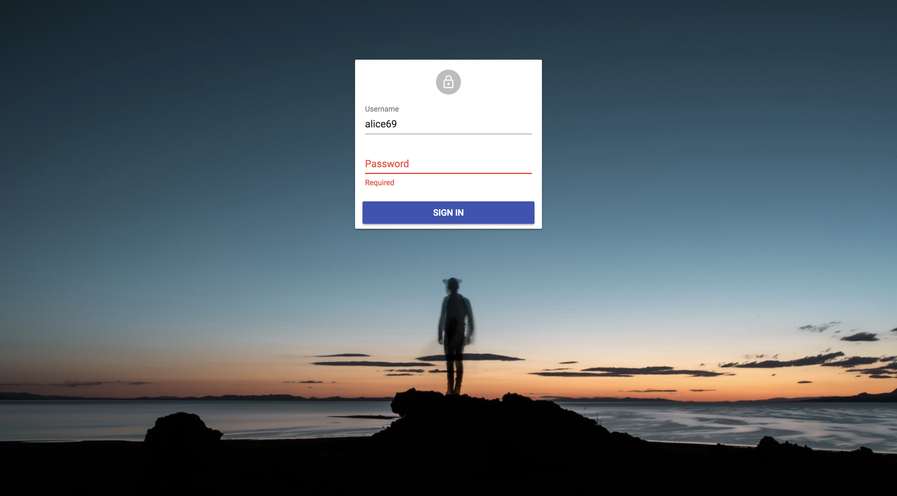
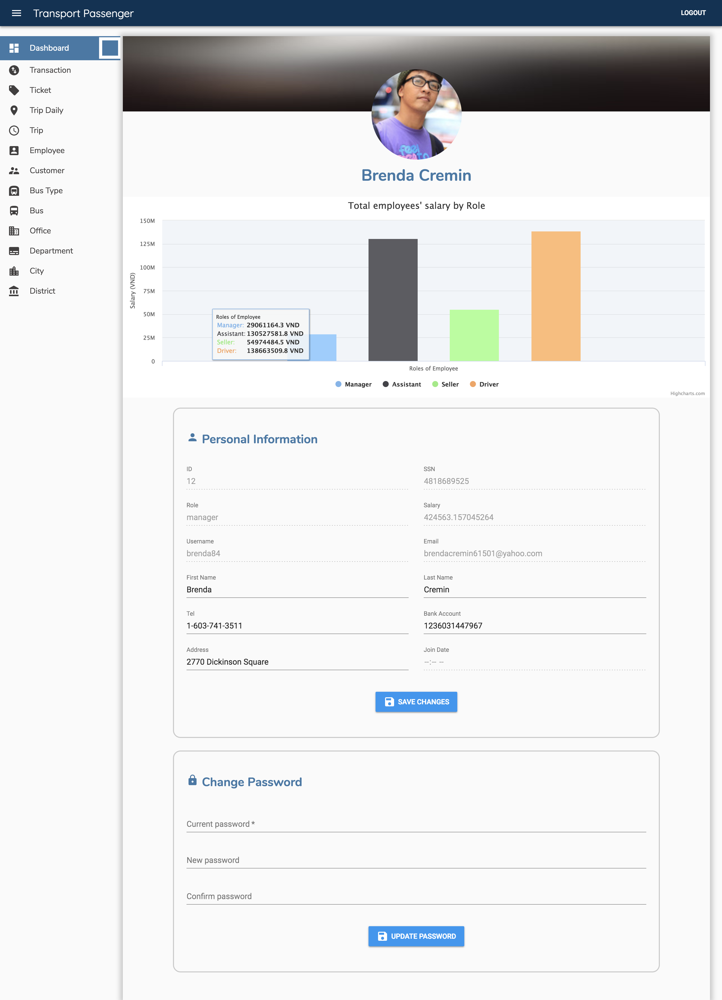
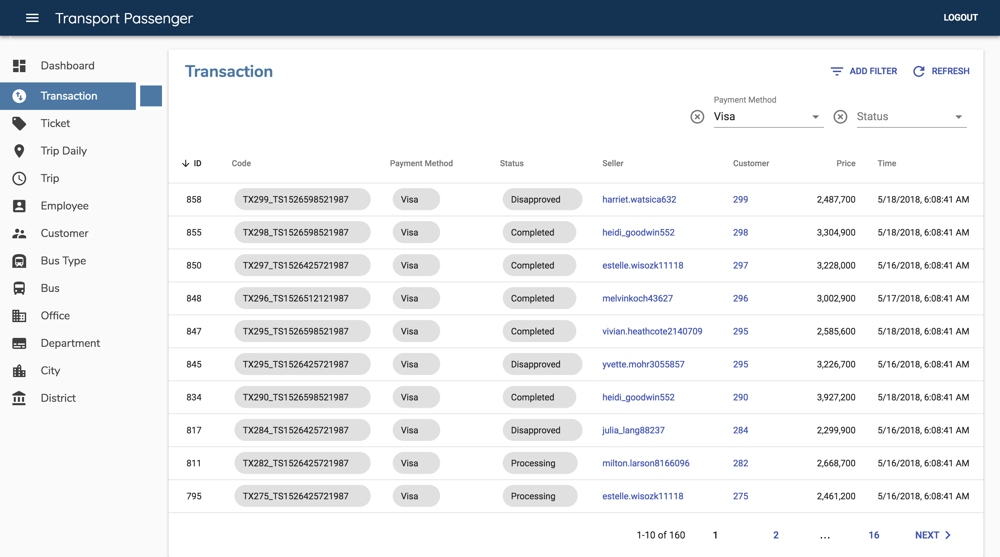
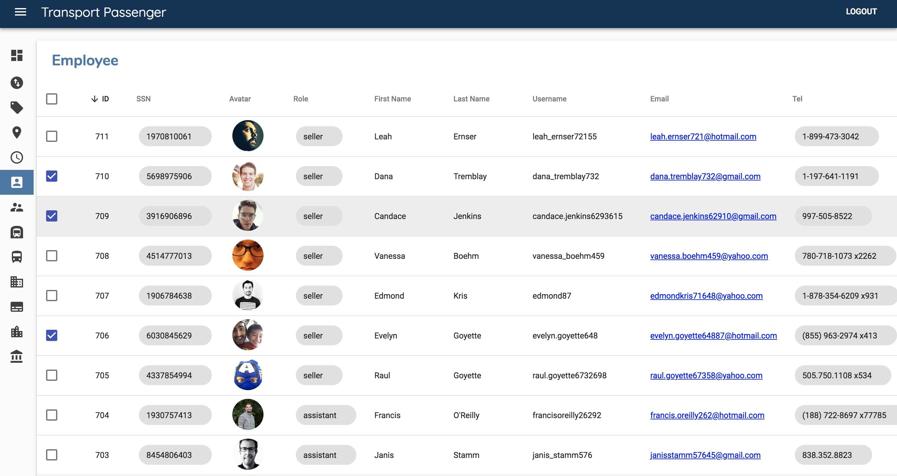

# Transport Passenger

Assignment Database System - Transport Passenger System

## Keywords
NodeJS, Sequelize (Postgres SQL), ReactJS, Heroku (App, Postgre), Amazon AWS (EC2, S3)

## Document
Document on [https://huynhsamha.github.io/transport-passenger/](https://huynhsamha.github.io/transport-passenger/)

## Demo

[https://transport-passenger.herokuapp.com/](https://transport-passenger.herokuapp.com/)

Username and Password for demo:
```
manager		: "brenda84"	-	brenda84?
driver		: "rosa23"	-	rosa23?
seller		: "alice69"	-	alice69?
assistant	: "jan58"	-	jan58?
```


## Introduction and Quickstart
+ View on [github.com](https://github.com/huynhsamha/transport-passenger/blob/master/docs/README.md)
+ View on [github.io](https://huynhsamha.github.io/transport-passenger/)


## APIs
+ View on [github.com](https://github.com/huynhsamha/transport-passenger/blob/master/docs/api/README.md)
+ View on [github.io](https://huynhsamha.github.io/transport-passenger/api/)


## Documents - Contributing
+ View on [github.com](https://github.com/huynhsamha/transport-passenger/blob/master/docs/docs/README.md)
+ View on [github.io](https://huynhsamha.github.io/transport-passenger/docs/)


## Deploy Heroku
+ View on [github.com]()
+ View on [gitub.io]()

## Deploy AWS
+ View on [github.com](https://github.com/huynhsamha/transport-passenger/blob/master/docs/aws/README.md)
+ View on [github.io](https://huynhsamha.github.io/transport-passenger/aws/)


## Screenshots






